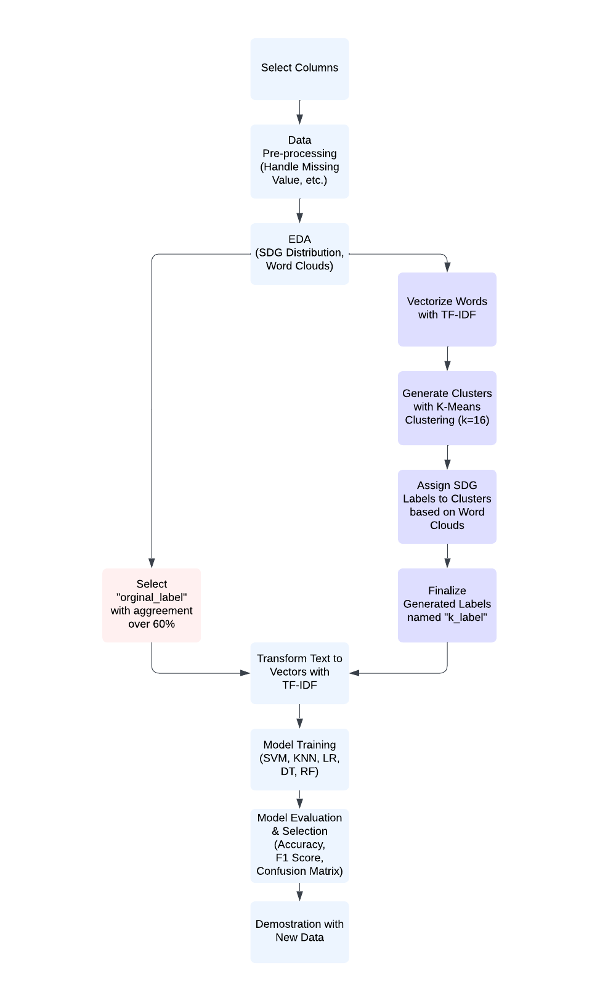

# Building SDG Classifier: Monitor the Progress of the SDGs using Machine Learning

This project is mainly about using multiple sets of labels to create different cofident classifiers to classify SDG related document excerpts to 17 SDGs and save human effort in multi-labeling.


## Abstract
The Sustainable Development Goals (SDGs) were introduced by the United Nations in 2015, but recent reports show that the world has made no progress towards achieving them for two consecutive years due to various crises. To monitor the impact of the SDGs, data providers are called to develop innovative forms of data to assist in SDG impact monitoring.

Researchers have studied this topic with SDG-related documents. However, none of the methods used are fully capable of managing the SDGs since each project or financial aid could assist in the development of multiple SDGs.

This paper aims to demonstrate the need for multi-label datasets for SDG documents and generate insights for multi-labeling to save human effort. The multi-class dataset used is from the OSDG Community Dataset (OSDG-CD), and two sets of labels are used for this project. One is provided by OSDG-CD, and the other is generated by the authors using Term Frequency Inverse Document Frequency (TF-IDF) and K-Means Clustering.

The paper builds ten multi-class classifiers with a combination of five algorithms, including Support Vector Machines, K-Nearest Neighbors, Logistic Regression, Decision Trees, and Random Forest, and two label sets. Two SVM classifiers are selected after evaluating their performance with Accuracy, F1 Score, and Confusion Matrix. The SVM classifiers built with original labels and generated labels achieved 84% and 92% accuracy respectively.

This paper successfully demonstrates that one text can belong to multiple SDGs. By providing a framework for multi-label classification, this work can potentially advance multi-labeling and policymaking on the SDGs.

**Keywords: Sustainable Development Goals, Natural Language Processing, Machine Learning, Multi-class Classification, Clustering**
## Skills
Python, Supervised Machine Learning, Unsupervised Machine Learning, Natural Language Processing

## Data Source

**[Dataset]**

The file contains 41,688 text excerpts and a total of 297,625 assigned labels (version 2023.04)

https://zenodo.org/record/7816403#.ZExE-ezML0o

**[Source Data]**

The dataset consists of paragraph-length text excerpts derived from publicly available documents, including reports, policy documents and publication abstracts. A significant number of documents (more than 3,000) originate from UN-related sources such as SDG-Pathfinder and SDG Library. These sources often contain documents that already have SDG labels associated with them. Each text is comprised of 3 to 6 sentences and is about 90 words on average.

**[Column Description]**

doi - Digital Object Identifier of the original document

text_id - unique text identifier

text - text excerpt from the document

sdg - the SDG the text is validated against

labels_negative - the number of volunteers who rejected the suggested SDG label

labels_positive - the number of volunteers who accepted the suggested SDG label

agreement - agreement score based on the formula:

agreement = |labelspositive − labelsnegative| / (labelspositive + labelsnegative)


## Methodology



## Run Locally

Clone the project

```bash
  git clone https://github.com/manyuzhang1996/Building-SDG-Classifiers-with-Machine-Learning.git
```

## Elevator Pitch Video
https://www.youtube.com/watch?v=5Hel45oB4j0

## Contact
Manyu Zhang (zhangmanyuzmy@gmail.com)
